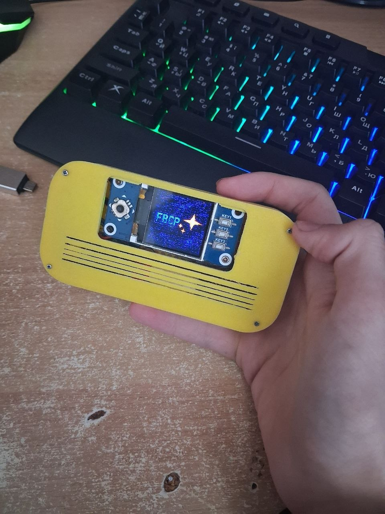
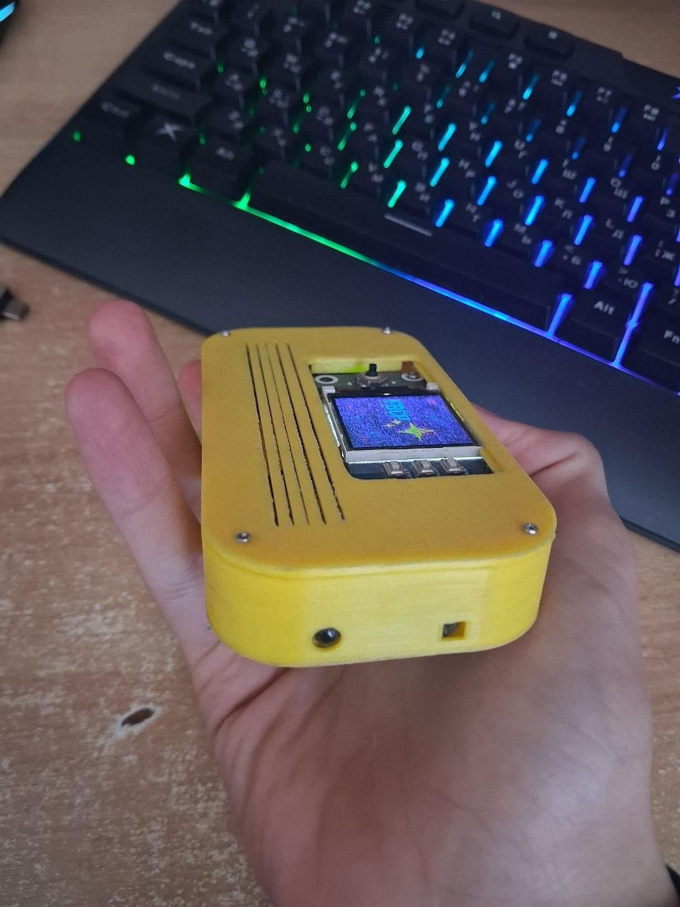
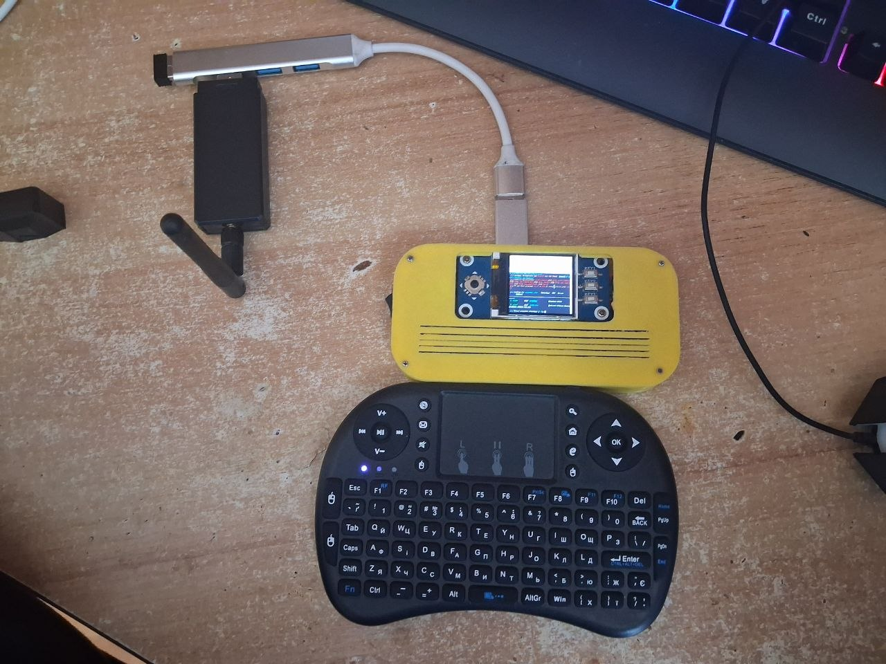
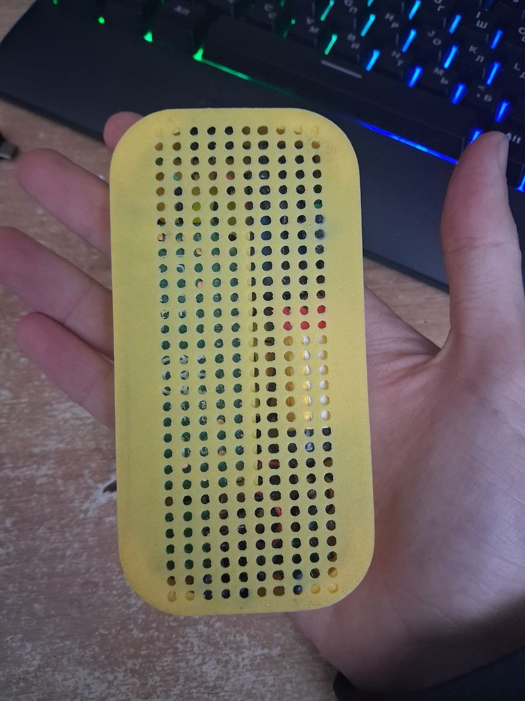
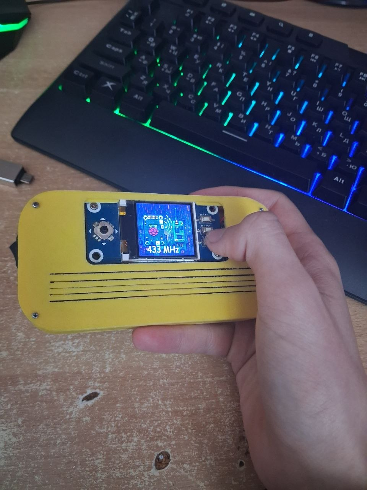

# Raspberry Pi Security Testing Toolkit

A comprehensive Python-based toolkit for Raspberry Pi that provides an interactive menu system for various wireless security testing and RF (Radio Frequency) experimentation tools. The project includes FM transceiver functionality, Bluetooth device scanning, 433 MHz RF transmission/reception, and audio-based wireless attacks.

## Features

### 🎮 Interactive Menu System
- **ST7735 TFT Display Support**: 128x160 color display integration
- **Multi-button Control**: Support for directional buttons and joystick input
- **Navigation Interface**: Easy-to-use menu navigation with visual feedback

### 📡 Wireless Modules

#### FM Transceiver (fm_trx.py)
- FM frequency tuning and monitoring
- WAV file playback functionality
- Real-time frequency adjustment
- Interactive menu-based operation

#### Bluetooth L2ping Attack (l2ping.py)
- Bluetooth device discovery and scanning
- L2ping attack functionality
- Device address enumeration
- Bluetooth security testing capabilities

#### 433 MHz RF Module (rpi433.py)
- RF signal reception and decoding
- RF signal transmission
- Protocol detection
- Pulse length analysis
- Support for RF433 wireless devices

#### Sour Apple Module
- Additional wireless security testing functionality
- Modular design for extensibility

## 📸 Проект в дії (Project Gallery)

### Фізична реалізація проекту (Hardware Setup)






## Hardware Requirements

### Display
- **ST7735 TFT Display** (128x160 pixels)
  - Connection: SPI interface
  - Control Pins: DC (GPIO 25), RST (GPIO 27), Backlight (GPIO 24)

### GPIO Controls
- **Button UP**: GPIO 21
- **Button DOWN**: GPIO 16
- **Button SELECT**: GPIO 20
- **Joystick UP**: GPIO 6
- **Joystick DOWN**: GPIO 19
- **Joystick PRESS**: GPIO 13

### Additional Hardware
- Bluetooth module (for L2ping functionality)
- 433 MHz RF transceiver module
- FM transceiver module
- Audio output (for WAV file playback)

## Project Structure

```
menu_new/
├── kern.py                 # Main kernel and menu system
├── README.md               # This file
├── imgmenu/                # Menu images and icons
├── Sour-Apple/             # Sour Apple security testing module
├── src/                    # Source modules
│   ├── fm_trx.py          # FM transceiver functionality
│   ├── l2ping.py          # Bluetooth L2ping attack tool
│   ├── rpi433.py          # 433 MHz RF transceiver
│   └── sourapple.py       # Additional utilities
└── wavfiles/               # Audio files for playback
```

## Installation

### Prerequisites
```bash
sudo apt-get update
sudo apt-get install python3-pip python3-dev
sudo apt-get install libbluetooth-dev
```

### Required Python Packages
```bash
pip3 install pillow
pip3 install RPi.GPIO
pip3 install PyBluez
pip3 install rpi-rf
pip3 install st7735
```

### GPIO Access
Make sure your user has GPIO access rights:
```bash
sudo usermod -a -G gpio $USER
```

## Usage

### Starting the Application
```bash
sudo python3 kern.py
```

### Navigation
- Use **UP/DOWN buttons** or **Joystick UP/DOWN** to navigate menu items
- Press **SELECT button** or **Joystick PRESS** to select an option
- Each module can be exited by returning to the main menu

### Available Functions

1. **FM Transceiver**: Tune and transmit FM frequencies, play WAV files
2. **Bluetooth Scanner**: Discover nearby Bluetooth devices, perform L2ping tests
3. **433 MHz RF**: Receive and transmit RF signals at 433 MHz frequency
4. **Sour Apple**: Additional security testing features

## Configuration

### Modify GPIO Pins
Edit the GPIO pin definitions in `kern.py`:
```python
BUTTON_UP = 21
BUTTON_DOWN = 16
BUTTON_SELECT = 20
Joystick_UP = 6
Joystick_Down = 19
Joystick_Press = 13
```

### Adjust Display Settings
Display configuration in `kern.py`:
```python
disp = ST7735(
    port=0,
    cs=0,
    dc=25,
    rst=27,
    backlight=24,
    width=128,
    height=160,
    rotation=90,
)
```

### Change WAV File Directory
In `src/fm_trx.py`, modify:
```python
directory = "/home/alex/wavfiles"
```

## API Reference

### FM Transceiver
```python
fmtrx(original_img, disp, GPIO, Joystick_UP, Joystick_Down, 
      Joystick_Press, BUTTON_UP, BUTTON_DOWN, BUTTON_SELECT, 
      fm_opt, draw, font)
```

### Bluetooth L2ping
```python
l2ping_attack(disp, original_img, BUTTON_UP, BUTTON_DOWN, BUTTON_SELECT)
```

### 433 MHz RF Module
```python
rpi433_menu(disp, original_img, BUTTON_UP, BUTTON_DOWN, BUTTON_SELECT)
```

## Security & Disclaimer

⚠️ **IMPORTANT**: This toolkit is designed for **authorized security testing and educational purposes only**. Unauthorized access to computer systems and networks is illegal. Users are responsible for:

- Obtaining proper authorization before testing any systems
- Complying with all applicable laws and regulations
- Using this toolkit responsibly and ethically

RF transmission is regulated in most countries. Ensure compliance with local regulations before transmitting on 433 MHz or any other frequency.

## Troubleshooting

### Display Not Showing
- Check SPI interface is enabled: `sudo raspi-config` → Interfacing Options → SPI
- Verify GPIO pin connections
- Test with: `gpio readall`

### Button Input Not Working
- Ensure GPIO pins are correctly configured
- Check button pull-up settings in code
- Verify physical button connections

### Bluetooth Issues
- Enable Bluetooth: `sudo systemctl start bluetooth`
- Check with: `bluetoothctl`
- Ensure PyBluez is properly installed

### RF Module Not Detecting Signals
- Verify GPIO pin for RF module
- Check RF module is powered
- Ensure antenna is properly connected

## Contributing

This is an educational/research project. Improvements and bug fixes are welcome.

## License

[MIT]

## Author

[Alex / root616C6578]

## References

- [ST7735 Documentation](https://www.adafruit.com/product/2715)
- [RPi.GPIO Documentation](https://pypi.org/project/RPi.GPIO/)
- [PyBluez Documentation](https://pybluez.readthedocs.io/)
- [rpi-rf Library](https://github.com/milaq/rpi-rf)

---

**Last Updated**: January 2026

